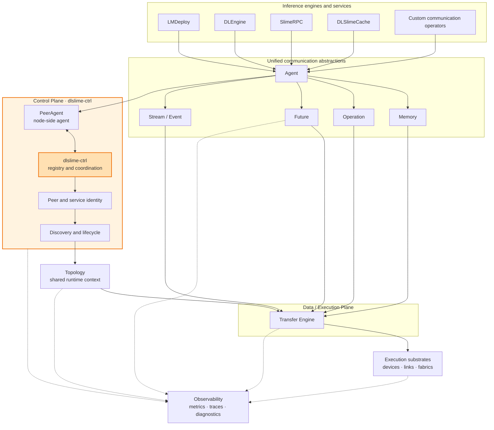

# DLSlime 3.0 — From Transfer Engine to Communication Runtime

_Roadmap revision: 2026-09 to 2026-11_

## Quarter Theme

DLSlime 2.0 established a high-performance transfer engine and its execution
model for heterogeneous data movement. After a period of rapid development,
DLSlime is now evolving beyond that single-engine model toward a communication
runtime for inference engines such as LMDeploy and DLEngine. We already have
peer discovery and lifecycle management,
named memory regions, asynchronous and device-aware completion, heterogeneous
transport backends, RPC and cache services, and an initial end-to-end
integration with DLEngine. These capabilities prove that DLSlime can connect
service semantics, device memory, and high-performance data movement in one
system.

At the same time, new Scale-Up fabrics are emerging. They may
provide communication capabilities with topology, memory visibility,
connection, and synchronization semantics that do not fit the assumptions of
traditional network transports. DLSlime 3.0 therefore needs an abstraction
that can absorb new classes of links as they appear, instead of defining the
runtime around today's RDMA, TCP, or device-specific execution model. This is
part of the roadmap: make the communication runtime ready for the next
generation of Scale-Up systems and use those systems to drive the new runtime
contracts.

The same evolution applies to cache storage. We have not forgotten this
neighboring part of the data path: DLSlime 3.0 will keep a sustained focus on
cache storage and invite contributions that help define how its ownership,
consistency, topology, and asynchronous operations should relate to the
communication runtime.

That growth has also left technical debt at several layers:

- **Runtime model layer.** We have not yet made clear that Transfer, Memory,
  Topology, and Future are fundamental parts of the communication-runtime
  abstraction. In the current transfer-engine model they are too easily treated
  as properties contained by a particular backend. That is workable for a
  single-engine, RDMA-only design, but not for a runtime that must compose
  multiple engines and link classes. These concepts need stable semantics above
  any one Transfer Engine so that memory identity, topology knowledge, and
  operation completion can be reused across engines.
- **Control and execution layer.** Agent currently does not uniformly manage
  Transfer Engine instances and their operation lifecycles. As a result,
  control-plane capabilities such as identity, discovery, and topology cannot
  reinforce multi-backend execution, while backend capabilities and execution
  state cannot feed back into the control-plane model. The two sides exist, but
  they do not yet form a mutually reinforcing runtime.
- **Integration layer.** The API between application intent and communication
  execution has not been formalized. RPC, Cache, and DLEngine consequently
  define their own operation descriptions, completion expectations, and memory
  lifetimes instead of targeting one explicit runtime contract.

The individual capabilities exist, but the layers are not yet truly
composable or pluggable.

This release consolidates those capabilities into one runtime from Agent to
Transfer Engine. Applications will describe communication through stable
Memory, Operation, Future, and Stream semantics, while transport and execution
backends remain interchangeable beneath them. RPC, Cache, and DLEngine will be
the first consumers of the same runtime. The objective is not interface cleanup
for its own sake: the new architecture is complete only when multiple
applications and multiple backends run end to end without application-specific
transport integration.

## A Layered Communication Runtime

A communication runtime is not a single transport pipeline. It is a layered
architecture: many applications and services share one programming model,
while many execution backends and physical links implement that model. The
middle layers provide the stable abstractions and runtime coordination that
make those two sides independently extensible.

Peer and service identity belong to the Control Plane because they describe
who can communicate and whether that identity is still valid, independently of
any individual transfer. `dlslime-ctrl` provides registry and coordination,
while `PeerAgent` is the node-side agent that consumes that state. Topology is a
shared runtime context produced and updated by control-plane discovery, then
consumed by Agent planning and the Transfer Engine. Transfer Engine is the
Data / Execution Plane: it executes an operation within the topology rather
than owning the topology itself.

Observability is deliberately drawn outside the layers. Metrics, traces, and
diagnostics observe control state, topology changes, logical operations,
completion, and backend execution without becoming another policy or
execution layer.

DLEngine, SlimeRPC, Cache, and future applications should be able to select the
same abstractions without knowing which backend executes an operation. In the
other direction, a backend should implement the runtime contracts once and be
usable by multiple applications. DLEngine still owns sequence scheduling, cache
layout, placement semantics, and the meaning of KV, GDN, Indexer, MTP, and
compressed-cache plans; DLSlime owns the communication runtime that executes
those plans. Integrating a particular third-party middleware is therefore an
implementation choice, not the purpose of this release.

Based on this layered model, this quarter will complete the common abstractions
and their end-to-end composition from Agent to Transfer Engine.

## Roadmap Focus: Core Runtime Contracts

This is an initial contract draft, not a final API specification. The purpose
of this roadmap is to make the ownership and composition of the runtime
concepts explicit before filling in implementation-level details.

| Concept | Initial 3.0 role |
| --- | --- |
| **Agent** | Runtime facade that binds application intent to peers, Topology, Memory, and a Transfer Engine. |
| **Topology** | First-class description of resources, links, memory visibility, and capabilities used for planning. |
| **Memory** | Logical identity and lifetime of a data region, independent of backend materialization. |
| **Operation** | Backend-independent description of a communication action or plan. |
| **Future** | Unified logical completion, error, cancellation, and lifetime boundary. |
| **Stream** | Ordering and dependency context for operations and device execution. |
| **Transfer Engine** | Execution component that submits and progresses operations within a Topology. |

The key 3.0 decision is that Transfer, Memory, Topology, and Future belong to
the communication-runtime abstraction itself. They must not be implicitly
contained by one transfer backend. Event and signal mechanisms may implement
these contracts internally; their public shape remains an open design question.

## What Makes DLSlime 3.0 Distinct

The 3.0 roadmap should strengthen capabilities already present in DLSlime
while defining a communication runtime broader than any single transfer
engine:

1. **Declarative peer runtime.** PeerAgent combines topology discovery,
   desired connection state, registration, heartbeat, stale-state cleanup,
   resource materialization, and peer metadata.
2. **Service-shaped data plane.** The same runtime supports raw data movement,
   SlimeRPC, cache services, and Prefill/Decode migration instead of requiring
   a separate communication stack for each.
3. **Inference-aware plans without transport coupling.** DLEngine retains the
   semantic layout of KV, GDN, Indexer, MTP, sparse, and compressed state while
   DLSlime executes the resulting named-memory operations.
4. **Device and communication synchronization.** Existing DeviceSignal
   semantics already connect GPU readiness, per-QP completion, CPU waits, and
   stream waits. A unified Future should preserve this capability rather than
   collapse it into host-only polling.
5. **Progressive adoption.** Applications may use a raw Endpoint, a managed
   PeerAgent, or complete RPC/Cache services while sharing the same backend
   implementations.
## Continued Focus On Cache Storage

DLSlime's communication runtime does not end at peer-to-peer movement. We are
also continuing to track cache storage as a closely related part of the data
path: cache and model state may move between devices, hosts, memory pools, and
persistent or remote storage. Cache storage brings its own requirements for
addressability, durability, consistency, staging, prefetch, eviction, and
asynchronous completion. These requirements should eventually compose with the
same logical Memory, Operation, Future, and Topology model without turning
Storage into another transport-specific Endpoint.

This roadmap records cache storage as an explicit area of attention and a
future integration surface. The immediate goal is to clarify the boundary and
shared semantics with the communication runtime, not to prescribe one storage
engine or absorb a complete storage stack into DLSlime.

### Call For Contribution

We invite contributions from people working on cache storage, KV storage, memory
tiering, persistence, remote object stores, and storage-aware schedulers. In
particular, we are looking for proposals and prototypes covering:

- Storage-backed Memory and its ownership, lease, and invalidation rules;
- Operation and Future semantics for asynchronous read, write, prefetch, and
  eviction;
- Topology models that include storage tiers and paths as well as devices and
  networks;
- DLEngine and DLSlimeCache integration without duplicating cache placement or
  scheduling policy.

Please open an issue or discussion with a concrete use case, proposed
abstraction, and compatibility constraints. Cache storage is part of the 3.0
areas of focus, and its relationship to the runtime should be shaped with the
community rather than finalized in isolation.

## Workstreams

The workstreams below are outcome-oriented. Detailed API proposals, ownership
rules, compatibility questions, and implementation tasks are tracked in
[issue #22](https://github.com/JimyMa/DLSlime/issues/22).

### 1. First-Class Runtime Concepts

Make Memory, Future, and Topology explicit runtime abstractions rather than
details hidden inside one Transfer Engine.

### 2. Unified Endpoint Interface

Define one coherent Endpoint-facing operation model that can express the
common semantics without exposing backend-specific handles.

### 3. Agent-Owned Transfer Engines

Let Agent uniformly manage Transfer Engine instances, path selection, operation
completion, and lifecycle so control-plane and execution capabilities reinforce
each other.

### 4. Application Capabilities

Adopt the runtime in DLEngine first, then extend the same contracts to
SlimeRPC, DLSlimeCache, and other inference-engine integrations.

### 5. New Links and Cache Storage

Use emerging Scale-Up fabrics and continued cache-storage attention to validate
and extend the runtime beyond a single transport or memory tier.

## Definition Of Done

This roadmap revision is complete when:

- DLEngine describes migration with logical Memory and operations, receives a
  unified Future, and does not access endpoint classes or backend handles.
- DLEngine no longer needs a device-wide synchronize solely to make a completed
  transfer visible to subsequent kernels.
- SlimeRPC, Cache, DLEngine migration, and Endpoint-facing operations share the
  same Memory lifetime and Future terminal-state contract.
- A consumer does not branch on RDMA, NVLink, TCP, Ascend, UCX/NIXL, or NCCL
  implementation types for an operation supported by the common contract.
- Agent can explain the selected path and report logical and child completion
  telemetry for every operation.
- Adding a backend requires only capability declaration, Memory
  materialization, submission, completion adaptation, and tests; it does not
  require changing DLEngine layout or service protocols.
- Fallback and backend-internal multi-rail preserve ordering, memory lifetime,
  error semantics, remote visibility, and device synchronization under one
  logical Future.
